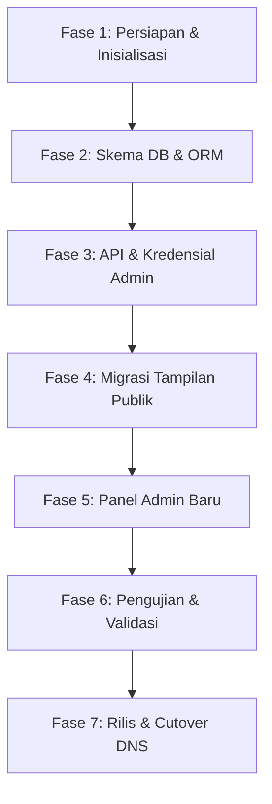

# Rencana Kerja Migrasi Web GKJ Tangerang

Dokumen ini memuat peta jalan (*roadmap*) dan rencana kerja sistematis untuk memigrasikan website GKJ Tangerang dari framework CodeIgniter 3 (PHP) ke arsitektur modern Next.js (TypeScript) dengan basis styling Tailwind CSS dan ORM database.

---

## 1. Arsitektur Target (Target Tech Stack)

| Lapisan Teknis | Teknologi Saat Ini (Legacy) | Teknologi Baru (Modern) |
| :--- | :--- | :--- |
| **Framework Utama** | CodeIgniter 3.x (PHP 7.x) | **Next.js 14+ (App Router)** |
| **Bahasa Pemrograman**| PHP | **TypeScript / JavaScript (ES6+)** |
| **Desain & Styling** | Custom CSS / Bootstrap 4 / Tailwind CDN | **Tailwind CSS (Native & Compiled)** |
| **Akses Database** | CI Active Record (SQL Manual) | **Prisma ORM / MySQL Node Driver** |
| **Autentikasi Admin** | CI Session (MD5 Password) | **NextAuth.js / Auth.js (Bcrypt/Argon2)** |
| **Manajemen Aset** | Local Disk (uploads/) | **AWS S3 / Cloudinary / Local Disk Optimized** |

---

## 2. Fase Eksekusi Migrasi

### 🗓️ Fase 1: Persiapan & Inisialisasi Proyek
1. Inisialisasi repositori baru untuk proyek Next.js.
2. Setup konfigurasi TypeScript, ESLint, Prettier, dan Tailwind CSS.
3. Konfigurasi Google Fonts (Inter, Outfit, Playfair Display) dan ikon (Material Symbols Outlined) pada layout global Next.js.
4. Buat folder arsip untuk kode legacy CodeIgniter agar memudahkan referensi kode.

### 🗄️ Fase 2: Migrasi Database & Setup ORM
1. Ekspor skema database lama (`gkjtangerang_2024`) ke environment lokal.
2. Buat skema database baru yang bersih (disesuaikan dengan hasil rekomendasi [Audit Database](file:///d:/AI/gkjtangerang.org-new%20design/docs/database-audit.md)):
   * Satukan tabel profil statis (`tbl_alamat_gereja`, `tbl_email_gereja`, dll) ke tabel terpadu `tbl_settings`.
   * Ubah nama tabel legacy sekolah (`tbl_siswa` -> `jemaat`, `tbl_guru` -> `majelis`).
3. Hubungkan proyek Next.js dengan MySQL melalui **Prisma ORM**. Jalankan `npx prisma db pull` dan definisikan relasi (`@relation`) secara formal di berkas `schema.prisma`.

### 🔑 Fase 3: Pembuatan API & Otentikasi Admin
1. Setup **NextAuth.js** untuk mengamankan halaman admin.
2. **Kompatibilitas Password MD5**: Karena password lama dienkripsi menggunakan MD5, buat flow login khusus:
   * Jika pengguna login dengan password yang setelah di-MD5 cocok dengan hash di database, biarkan masuk, lalu **secara otomatis lakukan re-hash** password tersebut menggunakan **bcrypt** dan simpan kembali ke database.
   * Konten login berikutnya akan dinilai menggunakan komparasi bcrypt standar.
3. Buat API Route (`/api/renungan`, `/api/tulisan`, `/api/agenda`) untuk memproses operasi CRUD yang akan dikonsumsi oleh panel admin maupun halaman publik.

### 🎨 Fase 4: Migrasi Halaman Publik
1. **Layout Utama**: Buat layout global (`app/layout.tsx`) yang memuat Navbar dan Footer dinamis yang mengambil menu aktif langsung dari database (`tbl_menu` & `tbl_sub_menu`).
2. **Halaman Beranda (`app/page.tsx`)**: Salin struktur desain hero slider, warta jemaat terpopuler, renungan harian terbaru, dan jadwal ibadah.
3. **Halaman Renungan (`app/renungan/page.tsx`)**:
   * Halaman daftar dengan pagination server-side.
   * Halaman detail dengan dynamic routing `/renungan/halaman/[slug]/page.tsx`.
   * Pertahankan logic visualisasi nats ayat, bacaan Alkitab, doa pembuka, dan pokok doa dengan styling Tailwind Navy-Gold yang premium.
4. **Halaman Berita/Artikel (`app/blog/[slug]/page.tsx`)**: Migrasikan halaman berita lengkap dengan sidebar artikel populer dan kategori.

### 🖥️ Fase 5: Panel Admin Baru (Dashboard Admin)
1. Buat folder terproteksi `/app/admin` menggunakan NextAuth Middleware.
2. Buat halaman manajemen data renungan, warta, pengumuman, dan galeri menggunakan komponen Table interaktif (seperti TanStack Table).
3. Integrasikan Rich Text Editor modern (seperti TipTap atau Quill) di halaman tambah/edit renungan dan tulisan untuk menggantikan textarea bawaan CodeIgniter.

### 🧪 Fase 6: Pengujian & Validasi
1. **Validasi Konten & SEO**:
   * Pastikan seluruh slug renungan dan berita lama terpetakan dengan benar dan tidak menghasilkan halaman 404.
   * Buat redirect 301 untuk URL legacy jika ada struktur URL yang berubah secara signifikan untuk menjaga reputasi SEO Google.
2. **Pengujian Fungsional**: Lakukan uji coba penambahan data, pengunggahan gambar ke folder penyimpanan, pengubahan profil gereja, dan flow login admin.
3. **Uji Responsivitas**: Uji halaman pada berbagai perangkat (mobile, tablet, desktop).

### 🚀 Fase 7: Rilis & DNS Cutover
1. Deploy aplikasi Next.js ke platform hosting pilihan (Vercel, VPS Linux, atau Docker Engine).
2. Lakukan sinkronisasi database MySQL produksi terakhir untuk memastikan tidak ada renungan/artikel jemaat terbaru yang tertinggal.
3. Ubah konfigurasi record DNS (A Record / CNAME) domain `gkjtangerang.org` untuk mengarah ke server Next.js baru.
4. Setup sertifikat SSL (Let's Encrypt / Vercel Managed) untuk memastikan akses HTTPS aman.

---

## 3. Tantangan & Risiko Utama

* **Aset Gambar Legacy**: Terdapat ratusan gambar di folder `theme/images/` atau `assets/images/` di proyek CodeIgniter. Seluruh aset ini wajib disalin ke folder `/public` Next.js dengan struktur folder yang sama agar link gambar di database tidak rusak.
* **Perubahan Desain vs Data Existing**: Beberapa isi tulisan di database memiliki tag HTML kustom (`align="justify"`, ` `). Gunakan parser HTML yang aman seperti `html-react-parser` dengan tambahan sanitasi (`dompurify`) untuk merender konten di React/Next.js agar tidak rentan terhadap serangan XSS.
* **Ketimpangan Performa Database**: Query pengunjung (`tbl_pengunjung`) yang mencapai puluhan ribu baris dapat memperlambat loading. Buat index pada kolom `pengunjung_tanggal` atau migrasikan log pengunjung ke tools analytics pihak ketiga seperti Google Analytics/Plausible demi menjaga performa database.
